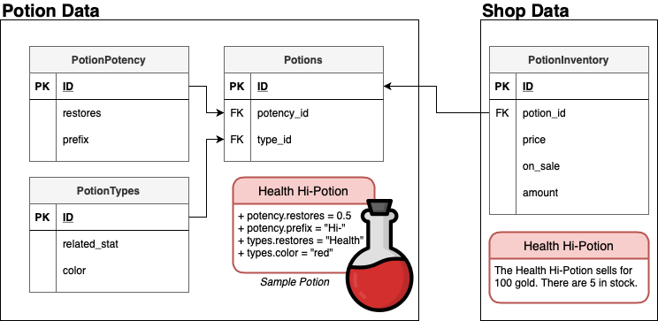

# Potion Shop: A Sample Falcon API
This project is a simple API written using Python's [Falcon framework](https://falcon.readthedocs.io/en/stable/) that contains some frequently-used components:
  * API Routes for performing CRUD operations on a PostgreSQL database
  * Using OAuth2 to secure POST, PUT, and DELETE calls
  * Logging failed requests to a database
  * Testing functionalities using pytest
  * Documenting available routes using Swagger UI / Open API

This file contains a project overview, system requirements, and how to build, run, and test the API.

--------------------------------------------------------------
## Additional Documentation

For information on the available API routes, view the Swagger UI by going to `localhost:8000/swagger` in a browser after building and running the project.

For information on the table schema used by this project, see [./docs/table_schema.md](./docs/table_schema.md).

For information on generating and using dummy auth tokens for certain requests, see [./docs/auth_token.md](./docs/auth_token.md).

--------------------------------------------------------------

## Potion Shop API Overview

The sample project is a simple Potion Shop Inventory API. You can:
* Define a new Potion (PotionType and PotionPotency combination)
* Define a new PotionType (color and which status it affects - for example: "a red potion changes the drinkers' health")
* Define a new PotionPotency (how strongly it affects the drinker and a word to describe it - for example "a Hi-Potion restores 50% of a status)
* Track the Inventory of the Potion Shop (how many Potions are available, what their price is, and if there is a sale)



For more information about the table schema, see [./docs/table_schema.md](./docs/table_schema.md).

### API Routes

Requests for this API are generally in the format:

Request Type        |  Request Format                       | Sample Request
------------------- | ------------------------------------- | ------------------------------
GET / POST          |  {BASE URL}/v1/{TABLE NAME}           | GET localhost:8000/v1/potions
GET / PUT / DELETE  |  {BASE URL}/v1/{TABLE NAME}/{ITEM ID} | GET localhost:8000/v1/potions/1

#### Route Prefixes
* Potions: `/potions`
* PotionTypes: `/potions/types`
* PotionPotency: `/potions/potency`
* PotionInventory: `/inventory`

There is also a route to describe Potions in a readable format:
```
GET /v1/potions/describe
GET /v1/potions/describe/{POTION ID}
```
If you include an ID for a specific Potion, you will receive a response such as: `The red Hi-Potion restores 50% of the drinker's Health.`
If you do not include an ID, you will receive a list of descriptions for all defined Potions.

#### Authentication
Any PUT, POST, or DELETE request will need a valid authentication RS256 OAuth2/JWT token. For information on generating and using dummy auth tokens for certain requests, see [./docs/auth_token.md](./docs/auth_token.md).

For more information on the available API routes, view the Swagger UI by going to `localhost:8000/swagger` in a browser after building and running the project.

--------------------------------------------------------------

## Project Requirements
* This project uses [Gunicorn](https://gunicorn.org), a Python WSGI HTTP Server for UNIX.
* Requires an installation of [PostgreSQL](https://www.postgresql.org) (Tested using `PostgreSQL 12.1`)
* Tested using `Python 3.8.5`.
* All Python packages are listed in [./config/requirements.txt](./config/requirements.txt)

--------------------------------------------------------------

## How to Build
To run the Potion Shop API, you will first need to create a local PostgreSQL database.

See the [Postgres Documentation](https://www.postgresqltutorial.com/postgresql-getting-started/) for how to install and configure a local database.

Use the following credentials:
  ```
  database name: postgres
  server: localhost
  port: 5432
  username: postgres
  password: admin
  ```
**Note:** If you use other credentials, you will need to change the [./config/config.yml](./config/config.yml) and [./config/pytest/config_pytest.yml](./config/pytest/config_pytest.yml) files
to the credentials you used.

After you have created the database, you can build using either the provided Dockerfile or a virtual environment.

### Build with Dockerfile
Run the following commands to build using the provided Dockerfile:
```shell
$ docker build -t potion-shop .
$ docker run -it --rm --name run-potion-shop -p 8000:8000 potion-shop
```

#### Troubleshooting
* Setting `-p 8000:8000` in the `docker run` command will make it so requests to localhost:8000 (first number) on the machine are forwarded to port 8000 (second number) on the docker image. If you are unable to send requests to the docker image, make sure that you have enabled port forwarding with this setting.
* If you are still experiencing problems, delete all existing docker images and containers created for this project to ensure a previous version isn't being cached and used in the build.
    * To view all existing containers: `docker ps -a`
    * To delete a container: `docker rm [container id]`
    * To view all existing images: `docker images`
    * To delete an image: `docker rmi [image id]`


### Build Locally
1. Create a virtual environment using `Python 3.8`.
    * I am using the [conda](https://docs.conda.io/en/latest/) package manager which comes with [Anaconda](https://www.anaconda.com/products/individual), but any Python virtual environment system works:
  ```shell
  $ conda create -n potion-env python=3.8
  $ conda activate potion-env
  ```

2. Install the project package as editable:
  ```shell
  $ pip3 install -e potion-shop/
  ```

3. Run Project
  ```shell
  $ python3 potion-shop/potion_shop
  ```
--------------------------------------------------------------

If everything works, you should see the following in your terminal after building using either version:
```
Starting setup for postgres database...
Connecting to DB...
Connected!
DB Configured successfully
Logging Level set to: INFO
Initialized Logging Table
<Log: 09/24/2020-17:13:13 - STARTUP: Logging configured successfully>
[2020-09-24 17:13:13 -0700] [35683] [INFO] Starting gunicorn 20.0.4
[2020-09-24 17:13:13 -0700] [35683] [INFO] Listening at: http://0.0.0.0:8000 (35683)
[2020-09-24 17:13:13 -0700] [35683] [INFO] Using worker: sync
[2020-09-24 17:13:13 -0700] [35687] [INFO] Booting worker with pid: 35687

```
**Note:** Your date and pid number will differ from the example given here.

### Troubleshooting
With either running the Dockerfile or using a virtual environment, if you are experiencing problems try:

* If you are having problems connecting to Postgres, try changing from `psycopg2` to `psycopg2-binary` in [./potion-shop/setup.py](./potion-shop/setup.py)
* Make sure `"potion-shop/"` is **NOT** in [./config/requirements.txt](./config/requirements.txt) or [./potion-shop/setup.py](./potion-shop/setup.py).
* Make sure there are no other services running on port 8000.

--------------------------------------------------------------

## Testing
Tests for the API are written using [pytest](https://docs.pytest.org/en/stable/).

Follow the instructions for "Build Locally" above to create and activate the virtual environment and install all packages.

Then, install the required testing packages (if not already installed):
```shell
$ pip3 install pytest pytest-falcon-client
```

Run the test suite:
```shell
$ python3 -m pytest potion-shop/tests
```

Expected Output:
```shell
============================= test session starts ==============================
platform darwin -- Python 3.8.5, pytest-6.0.2, py-1.9.0, pluggy-0.13.1
rootdir: ~/potion-shop/potion-shop/tests, configfile: pytest.ini
plugins: falcon-client-2.0.1
collected 116 items                                                            

potion-shop/tests/test_auth/test_auth_setup.py ...                       [  2%]
potion-shop/tests/test_auth/test_bad_auth.py .....................       [ 20%]
potion-shop/tests/test_auth/test_valid_auth.py .......                   [ 26%]
potion-shop/tests/test_configs/test_db_connection.py ..........          [ 35%]
potion-shop/tests/test_configs/test_log_level.py ..                      [ 37%]
potion-shop/tests/test_database/test_database_operations.py ....         [ 40%]
potion-shop/tests/test_database/test_invalid_methods.py ................ [ 54%]
.......................                                                  [ 74%]
potion-shop/tests/test_potion_utils/test_description.py ......           [ 79%]
potion-shop/tests/test_potion_utils/test_search.py ..................... [ 97%]
...                                                                      [100%]

============================= 116 passed in 8.23s ==============================
```
**Note:** Your runtime may vary.

### Test Coverage
To verify test coverage, I am using the 'coverage' python package.

#### To Check Coverage
1. Install Package
    ```shell
    $ pip3 install coverage
    ```

2. Run Pytests using Coverage
    ```shell
    $ coverage run -m pytest potion-shop/tests
    ```

3. View Results (in Terminal)
    ```shell
    $ coverage report
    ```

4. View Results (as HTML)
    ```shell
    $ coverage html
    $ open htmlcov/index.html
    ```

#### Current Coverage
Current Coverage is: **100%**.

Result of running `$ coverage report`:
```shell
Name                                                   Stmts   Miss Branch BrPart  Cover
----------------------------------------------------------------------------------------
potion-shop/potion_shop/__init__.py                        0      0      0      0   100%
potion-shop/potion_shop/application.py                    52      0      2      0   100%
potion-shop/potion_shop/configuration.py                   9      0      0      0   100%
potion-shop/potion_shop/database/__init__.py               0      0      0      0   100%
potion-shop/potion_shop/database/base.py                  14      0      2      0   100%
potion-shop/potion_shop/database/db_utils.py              22      0      0      0   100%
potion-shop/potion_shop/database/flavors.py               12      0      2      0   100%
potion-shop/potion_shop/database/logging/__init__.py       0      0      0      0   100%
potion-shop/potion_shop/database/logging/manager.py       29      0      0      0   100%
potion-shop/potion_shop/database/logging/models.py        29      0      0      0   100%
potion-shop/potion_shop/database/models.py                50      0      0      0   100%
potion-shop/potion_shop/database/operators.py             86      0     32      0   100%
potion-shop/potion_shop/middleware/__init__.py             0      0      0      0   100%
potion-shop/potion_shop/middleware/log_error.py           17      0      4      0   100%
potion-shop/potion_shop/middleware/oauth2.py              49      0     28      0   100%
potion-shop/potion_shop/middleware/stream_handler.py       4      0      2      0   100%
potion-shop/potion_shop/resources/__init__.py              0      0      0      0   100%
potion-shop/potion_shop/resources/database.py             93      0     22      0   100%
potion-shop/potion_shop/resources/potion_resource.py      36      0     12      0   100%
potion-shop/potion_shop/utils/__init__.py                  0      0      0      0   100%
potion-shop/potion_shop/utils/exceptions.py               16      0      0      0   100%
----------------------------------------------------------------------------------------
TOTAL                                                    518      0    106      0   100%
```

##### Known Coverage Issues:
- I have kept certain statements in the code that are used for sanity checks (such as ensuring the input to a helper function is a dictionary type) that should never be run when deployed. I am keeping the code in because it is helpful when debugging or adding new features, but have added a `# pragma: no cover` comment so those blocks are excluded from code coverage reports.
